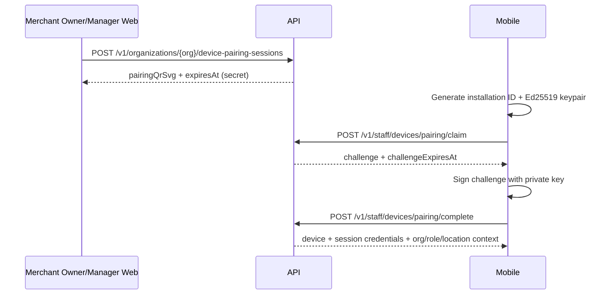
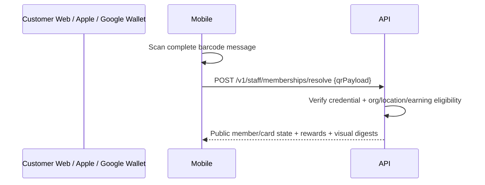
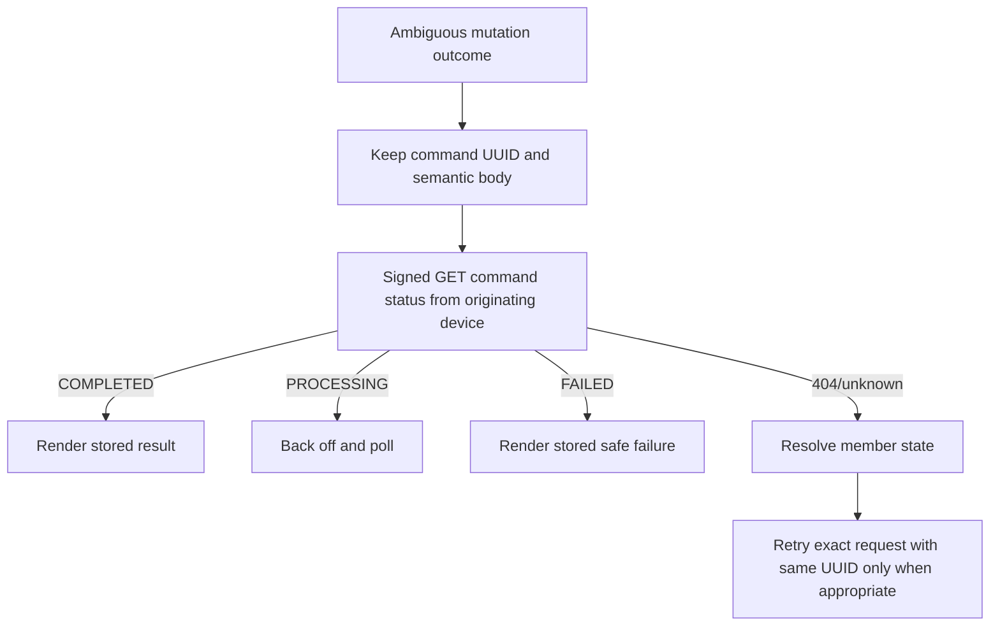

# Waflo Mobile — Production v1 Backend Contract

## MOBILE TEAM ACTION REQUIRED

**MOBILE_CODE_CHANGES_REQUIRED**

| ID | Severity | Current Mobile assumption | Current backend contract | Exact Mobile change | Endpoint/model affected | Before staging E2E |
|---|---|---|---|---|---|---|
| MOB-001 | High | A manager approval/override may authorize a stamp. | Manager approval is bound to `REDEEM` only. `managerOverride` is accepted by the historical stamp DTO but is explicitly non-authorizing. | Omit `managerOverride`; never offer or submit manager approval for stamp. | `POST /v1/staff/operations/stamps` | YES |
| MOB-002 | High | The historical code `PURCHASE_AMOUNT_BELOW_MINIMUM` identifies an insufficient purchase. | Executable code emits `PURCHASE_THRESHOLD_NOT_MET`. | Handle and localize `PURCHASE_THRESHOLD_NOT_MET`; retire the historical name. | Stamp error mapping | YES |
| MOB-003 | High | A cached plan/trial state can authorize an operation. | Each operation derives effective billing state; only unexpired `TRIALING`, `ACTIVE`, or `GRACE_PERIOD` is operational. The API emits `OPERATION_BILLING_BLOCKED`. | Treat the server response as authoritative and implement the current error state. | Resolve/stamp/redeem/reverse | YES |
| MOB-004 | High | The pre-repair Mobile build has no supported approval retry UX. | **BACKEND BLOCKER RESOLVED.** The first signed redeem creates a server-owned pending request and returns its public ID; Merchant Web decides it; the originating device retries the same semantic redeem with the same idempotency key and that ID. | Implement the supported manager-approval retry sequence and remove the old feature gate. Never call Merchant auth, compute/submit a fingerprint, expose internal IDs, synthesize approval state, or reuse stamp override. | Manager approval + redeem | YES |

MOB-004 is now a Mobile implementation requirement, not a backend blocker. BCK-001, BCK-002, and BCK-003 are resolved in executable source; BCK-004 remains a non-blocking pairing error-mapping issue.

Final classifications are `MOB-001 = STILL_REQUIRED`, `MOB-002 = STILL_REQUIRED`, `MOB-003 = STILL_REQUIRED`, and `MOB-004 = RESOLVED_BY_BACKEND` with **Mobile implementation still required for the new flow**.

## Document authority

This document is the canonical Staff Mobile integration contract for production v1 at the release identity below. Executable controllers, schemas, services, guards, migrations, and tests are authoritative. The exhaustive endpoint reference is [production-v1-endpoint-catalog.md](production-v1-endpoint-catalog.md), and physical testing is defined by [production-v1-e2e-checklist.md](production-v1-e2e-checklist.md).

Proven behavior is stated as contract. A recommendation is labeled as such. A source gap is labeled **KNOWN BACKEND GAP**. Historical M2 files remain immutable evidence, not current authority.

## Release identity

| Item | Value |
|---|---|
| Branch | `release/production-v1` |
| Commit | `763f2dfccdb24fb9bfa16457f0e49936840e20a1` |
| Prisma migration directories | `28` |
| Document generation date | `2026-08-11` |
| M2 baseline commit | `0cc39d9ecb39a34fdbd91498e55b6d6ac35c281e` |
| M2 contract version | `waflo-m2-mobile-contract-v1` |

## Product boundary

Waflo Mobile is Staff operational Mobile. Normal customer loyalty uses Customer Web, Apple Wallet, or Google Wallet; a customer Mobile app is not required. Merchant browser sessions, Customer Web sessions, Staff device sessions, and Wallet credentials are four separate security domains.

Merchant-facing product terminology is **Loyalty Card/Loyalty Cards**. `program` and `programVersion` are internal API/database concepts used to implement a Loyalty Card and its immutable enrolled version; they do not rename the product.

## Architecture relevant to Mobile

The API is a stateless Fastify/Nest service. Staff credentials and command results are persisted in PostgreSQL; Redis provides distributed rate limiting, not sticky application sessions. Mobile pairs an Ed25519 public key, receives an opaque device access/refresh bundle, signs every operational request, and treats all loyalty state returned by the server as authoritative.

Every response has `Cache-Control: no-store`. Normal success is `{ "data": ..., "requestId": "..." }`; errors use the envelope documented below. Request bodies are limited globally to 1 MiB.

No endpoint grants the client authority over organization, location, device, entitlement, or loyalty balance.

## Environment URLs

| Environment | API origin | Use |
|---|---|---|
| Staging | `https://api.staging.waflo.app` | Physical-device E2E after the staging deployment and readiness checks are green |
| Production | `https://api.waflo.app` | Release build only after production entry criteria pass |

HTTPS is mandatory. Mobile may call `GET /health` for optional diagnostics, but must not use it as a session or operation prerequisite. `GET /ready` is deployment infrastructure only.

## Authentication overview

Staff Mobile has no email/password, magic-link, invite, Merchant OAuth, API-key, cookie, customer login, or Apple/Google provider-credential login. Authentication is the combination of:

1. Merchant Owner/Manager authorization in Merchant Web to create a pairing session.
2. Proof that Mobile controls a newly generated Ed25519 private key.
3. An opaque Staff device access token bound to the paired device session.
4. An Ed25519 signature over each request.

`Authorization` is exactly `Device <opaque-access-token>`, not `Bearer`.

Authentication proves the session; authorization is evaluated from current organization membership and operation rules; device trust is the current `ACTIVE` device/session; organization membership is independently checked; location authorization comes from stored assignments; entitlements and loyalty state are always server-authoritative.

## Staff identity lifecycle

- A fresh install generates a stable installation identifier and an Ed25519 keypair. The private key should be non-exportable in Keychain/Keystore where supported.
- Staff identity, organization membership, and role are created/managed in the Merchant security domain. Mobile never submits the staff password or invite.
- The pairing QR selects the existing active staff membership and allowed location assignments.
- `OWNER`, `MANAGER`, and `STAFF` are read from the active organization membership on every signed request. A role change therefore takes effect without a new Mobile session.
- Every signed boundary reads authoritative database state for the underlying User, organization Membership, device, Location, `StaffLocationAssignment`, and device Location assignment before accepting the signature as an operational principal. Refresh performs the same lifecycle checks.
- User/account deactivation immediately revokes affected Staff device sessions, cancels unfinished pairing sessions, and expires pending/approved manager approvals. The next request is denied with `STAFF_USER_DEACTIVATED`/401. An external-provider revocation that deactivates the last-auth-method account has the same effect.
- `SUSPENDED` or `REMOVED` organization Membership revokes affected sessions, cancels unfinished pairings, expires pending/approved approvals, and makes the next request fail with `STAFF_MEMBERSHIP_INACTIVE`/401.
- Staff Location-assignment revocation revokes sessions at that Location, cancels unfinished pairings for the Staff member, expires pending/approved approvals at that Location, and makes the next request fail with `STAFF_LOCATION_ASSIGNMENT_INVALID`/401.
- Device revocation/compromise revokes all device sessions, expires its pending/approved approvals, and makes the next request fail with `STAFF_DEVICE_REVOKED`/401.
- An inactive Location or inactive device Location assignment is denied at every request and refresh with `STAFF_LOCATION_ASSIGNMENT_INVALID`/401. Restoring a Location does not clear any independently revoked session.
- Reactivating a User, Membership, or Staff Location assignment does not clear prior session `revokedAt`; the device must be paired again. Refresh never silently revives an old session.
- There is no direct Staff Mobile organization invite/accept flow.

## Device trust / pairing



The scanned pairing token is opaque. Its current wire form is environment-bound `waflo-pair-v1...`, but Mobile must not parse or construct it. The configured pairing lifetime is 2–30 minutes, capped by `DEVICE_PAIRING_TTL_MINUTES` (default 10 minutes). The proof challenge lasts exactly 2 minutes. Pairing is one-time: `PENDING → CLAIMED → COMPLETED`; expired, canceled, completed, or concurrently claimed sessions cannot be reused.

Claim fields are `pairingToken`, `installationId`, `publicKey`, `platform`, `appVersion`, and optional `osVersion`/`model`. The public key is Ed25519 SPKI in PEM or base64 DER. iOS/Android versions must be strict semantic versions and meet the configured minimum. `TEST_CLIENT` is forbidden in production. Completion supplies the public pairing UUID, exact challenge, base64url Ed25519 signature, and optional display name.

The first authorized location in the pairing request becomes the device session's current location. Additional device-location assignments are stored, but production v1 exposes no Mobile location-switch endpoint and no mutation accepts a client location override. A different current location requires a newly paired session with the desired location first.

Multiple completed devices for one staff member are allowed. A staff member may have only one active pairing attempt at a time. Installation IDs and public keys are globally unique. An app reinstall that loses the key/session is a new device and must be paired again; the prior device should be revoked. A lost/replaced device follows the same revoke-then-pair path.

`StaffLocationAssignment` has a supported Merchant lifecycle. Owner/Manager Merchant Web uses `GET /v1/organizations/:organizationId/members/:memberId/location-assignments` (`devices.view`), `PUT /v1/organizations/:organizationId/members/:memberId/location-assignments/:locationId` (`devices.pair`), and `DELETE` on the same item path (`devices.pair`). GET uses the Merchant cookie without CSRF; PUT/DELETE additionally require allowed Origin plus the `waflo_csrf` cookie and matching `x-csrf-token`. Owner may manage an eligible active organization member; Manager may manage only a `STAFF` target. Mobile must never call these endpoints and has no self-assignment path.

PUT has strict body `{ "earningAllowed": boolean, "redemptionAllowed": boolean }`; at least one must be true. It creates, reactivates, or updates the assignment and returns its organization/member/location display metadata, permissions, active/timestamps, and `changed`. Repeating the same active values is idempotent with `changed: false`. A changed PUT cancels unfinished pairings; permission narrowing also clamps existing device-Location permissions, so signed operations cannot retain a removed capability. PUT does not eagerly expire approval rows, but approval decision/consumption revalidation makes an approval whose redemption authority was narrowed stale/mismatched and non-consumable. A re-provision does not reactivate previously revoked sessions.

DELETE returns `{ organizationId, staffMemberId, locationId, status: "REVOKED", revokedAt, changed }`. The first active revocation sets `changed: true`, audits `staff.location_assignment_revoked`, revokes affected sessions, cancels unfinished pairings, and expires pending/approved approvals. Repeating it returns `changed: false` with the retained revocation timestamp. Provision/update events are audited only when values change. BCK-001 is **RESOLVED**; no seed, raw database access, unsupported administrative process, or missing provisioning API is part of the production contract.

The backend records pairing/device/session and revocation audit events. Never log or screenshot a live pairing QR/token.

## Session lifecycle

The completion response contains an access `token`, a `refreshToken`, and `expiresAt`. Default session lifetime is 30 days and configuration permits 1–90 days. There is no enforced Staff idle timeout; `lastActiveAt` is updated but not used as an expiry condition.

Persist as one secure credential bundle: Ed25519 private key reference, device public ID, device session ID, access token, refresh token, installation ID, and returned organization/location context. The access and refresh tokens and private key are secrets. Do not persist raw pairing token, proof challenge, QR credential, raw password/PIN/code, or request signatures. A pending approval public ID is not authentication, but it is sensitive operation state: retain it only with the protected pending command record until that command reaches a terminal state.

Refresh is proactive, not a recovery login: `POST /v1/staff/devices/session/refresh` itself requires a valid, unexpired, signed access session plus the refresh token and rechecks current User, Membership, device, Location, Staff assignment, and device assignment. It atomically revokes the old session/refresh credential and returns a replacement bundle; only one concurrent refresh succeeds. If access has expired or any lifecycle authority is revoked, Mobile must re-pair after an administrator restores eligibility. Replace the stored bundle atomically only after a successful response.

Logout is a signed `POST`, returns `204`, and revokes the current session. Clear all local credentials even if the network logout cannot complete; an administrator must revoke the device to guarantee server-side invalidation. Retrying a successful logout receives `401` because the session is already inactive.

Device revoke/mark-compromised revokes all its sessions. User deactivation, organization Membership suspension/removal, and Staff Location-assignment revocation also revoke affected sessions as described above. There is no Merchant endpoint to revoke one individual Staff session; self-logout and whole-device revocation are the exposed paths.

### Signed transport envelope

Every signed endpoint requires:

| Header | Contract |
|---|---|
| `Authorization` | `Device <opaque-token>` |
| `x-waflo-device-id` | Paired device public UUID |
| `x-waflo-device-session-id` | Current session UUID |
| `x-waflo-request-id` or `x-request-id` | Unique request identifier; recommendation: send the same UUID in both |
| `x-waflo-timestamp` | ISO 8601 timestamp; configured clock skew default 120 seconds, allowed 15–900 |
| `x-waflo-nonce` | New unique value per transmission, maximum 128 characters; replay store default 10 minutes |
| `x-waflo-body-sha256` | SHA-256 hex digest of the exact raw transmitted body; hash the empty body for GET/empty |
| `x-waflo-signature` | Base64url 64-byte Ed25519 signature |
| `x-idempotency-key` | UUID, additionally required for stamp/redeem/reverse only |
| `Content-Type` | `application/json` for JSON bodies |
| `Accept` | Recommendation: `application/json`; not required by executable validation |

The signed bytes are these newline-separated values, with the path excluding the query string:

```text
waflo-device-request-v1
METHOD
/exact/path
requestId
timestamp
nonce
lowercaseBodySha256
deviceSessionId
organizationId
```

Organization ID in the envelope is the server-stored context known from pairing/device-context, not a spoofable organization header. Never send manufactured organization, location, or device identity in mutation JSON. Retrying a transmission requires a new timestamp, nonce, request ID, digest/signature, while preserving the same semantic body and idempotency key.

`User-Agent` is optional standard telemetry and is not authentication. The API has no Staff API-version header, organization header, location header, or manager-approval header. Manager approval is a redeem JSON field only. The global `x-request-id` form permits `[A-Za-z0-9._-]{1,128}`; a UUID sent identically as `x-request-id` and `x-waflo-request-id` satisfies both global tracing and the signed envelope.

## Organization and location context

`GET /v1/staff/device-context` is the authoritative current context. It returns organization, staff role, current location, device/session public identifiers, platform/app version, minimum supported version, support flag, and request ID. It does not return assignment or billing records. The current organization/location are derived from the signed session, and mutations independently re-evaluate assignments and billing.

Operational eligibility additionally verifies current organization `ACTIVE`, organization membership `ACTIVE`, device and staff location assignments active, device earning/redemption flag, program lifecycle, membership, and billing. There is no current location-switch API. Cross-organization credentials are deliberately indistinguishable from invalid credentials.

## Roles and permissions

| Role | Direct resolve/stamp/redeem | Reverse | Manager approval | Pair/device administration | Boundary |
|---|---|---|---|---|
| `OWNER` | Allowed if all operational rules pass | Manager window; reason required | List/approve/reject server-issued requests in Merchant Web | Any eligible active organization target | Same organization; assigned location/device and billing still apply |
| `MANAGER` | Allowed if all operational rules pass | Manager window; reason required | List/approve/reject server-issued requests in Merchant Web | Only `STAFF` targets | Same organization; assigned location/device and billing still apply |
| `STAFF` | Allowed by direct Staff handlers if all operational rules pass | Only its own originating operation, same device, short window | Not allowed | Not allowed | Same organization/location/device |

The direct Staff handlers do not call the general permissions table; all three active roles may resolve/stamp/redeem when operational rules pass. Owner/Manager reverse defaults to 1,440 minutes, while Staff reverse defaults to 120 seconds. If role changes during a session, the next request sees the new role.

## Entitlements and capabilities

There is no Staff Mobile capabilities endpoint. `GET /v1/capabilities` reports Merchant external-auth and Wallet-provider availability and is **not** a Staff entitlement API.

Each resolve/mutation computes effective billing. Operational states are unexpired `TRIALING`, `ACTIVE`, and `GRACE_PERIOD`; pending activation, elapsed trial/past due, suspended, and canceled are blocked. STARTER/GROWTH/SCALE does not directly gate these loyalty mutations. Mobile may hide a control after a current server denial, but must still handle the server response and must not derive authority from cached plan data.

## Customer/member resolution



Mobile sends raw QR text in `{ "qrPayload": "..." }`; it does not parse it. Current credentials use a versioned `wfl1...` structure, but the syntax is server-owned. Unsupported versions, malformed/forged values, revoked/expired/transferred credentials, unknown memberships, and wrong-organization scans collapse to `MEMBERSHIP_CREDENTIAL_INVALID`/404.

The response exposes public membership ID, display name, Loyalty Card name, locale, progress, goal, reward readiness/cycles/projection, operational date/timezone, location earning/redemption flags, stamp limits/purchase requirements, visual asset digests, and available public rewards. It does not expose email, phone, credential secret, or database IDs.

Current resolve applies earning eligibility; a redemption-only location can therefore fail resolution before redeem. This is current executable behavior, not a Mobile permission to bypass resolution.

## QR / credential contract

Apple Wallet, Google Wallet, and Customer Web carry the same logical membership credential. Apple places it in the pass barcode message and Google in `barcode.value`; provider source does not change resolution. Credential rotation/transfer/revocation invalidates old values. Treat all QR text as opaque sensitive authentication material: do not log it, persist it, include it in analytics, or expose it beyond the active operational screen.

## Loyalty Card state model

The authoritative active grid has exactly two visual states:

- `FILLED` for indices `0 <= index < progress`.
- `EMPTY` for `progress <= index < goal`.

There is no gift/star/check third stamp state. `stampVisuals.filled` and `.empty` provide the only state names and optional content digests. At goal, `progress == goal`, all active stamps remain `FILLED`, and `rewardReady == true`. Mobile must not replace the last stamp with a reward icon.

After final reward redemption, the server appends reward and cycle-reset history atomically: `progress = 0`, `rewardReady = false`, `completedCycles` increments, `projectionVersion` advances, and all active positions render `EMPTY`. A milestone reward can become partially/fully redeemed without resetting the cycle.

Mobile never increments/decrements optimistically. A pending visual may be shown without altering the displayed authoritative count; render new progress only from a confirmed/replayed response or a fresh resolve/status result.

## Stamp flow

```mermaid
sequenceDiagram
  participant Mobile
  participant API
  participant DB
  Mobile->>API: Signed POST /v1/staff/operations/stamps + idempotency UUID
  API->>DB: Claim durable command; lock org/program/member/device
  API->>DB: Validate policy; append STAMP_ISSUED; update projection/rewards/outbox/audit
  DB-->>API: Commit serializable transaction
  API-->>Mobile: beforeProgress, progress, rewardReady, cycles, projectionVersion
```

Request fields are the QR, `amount` (1–30 plus policy maximum), optional purchase amount/currency, optional normalized merchant transaction reference, and optional observation time. `managerOverride` exists only for historical wire compatibility and cannot bypass purchase/daily policy. Currency is trimmed and uppercased. Merchant reference is NFKC-normalized, trimmed, whitespace-collapsed, uppercased, then stored as an HMAC digest; a matching reference is risk-blocked for 24 hours across the organization/program/location/key-version stamp scope.

The transaction durably claims the command, validates all current state, appends the ledger event, unlocks thresholds once, updates the projection, queues Wallet refresh, and writes audit/risk history. Wallet-provider delivery is asynchronous and cannot roll back committed loyalty state.

When a stamp reaches goal, response `progress == goal` and `rewardReady == true`; the next stamp is rejected with `FINAL_REWARD_PENDING_REDEMPTION`. Two different devices are serialized on the membership and apply in committed order. See retry rules below.

## Reward redemption flow

Redeem requires an available, unexpired reward entitlement public UUID belonging to the resolved membership and pinned Loyalty Card version. Direct redemption omits `managerApprovalPublicId` when the reward does not require approval.

```mermaid
sequenceDiagram
  participant Mobile
  participant Merchant as Manager Web
  participant API
  participant DB
  Mobile->>API: Signed redeem without approval ID + durable UUID key
  API->>DB: Reserve exact command; compute fingerprint; create PENDING approval
  API-->>Mobile: 409 MANAGER_APPROVAL_REQUIRED + public approval ID
  Merchant->>API: List then approve public request (Merchant cookie/CSRF)
  Mobile->>API: Retry exact redeem + same key + managerApprovalPublicId
  API->>DB: Atomically APPROVED→CONSUMED and redeem entitlement
  DB-->>API: Commit reward ledger/projection/history
  API-->>Mobile: Redeem result; final reward returns progress 0 / rewardReady false
```

For a non-approval reward, signed `POST /v1/staff/operations/redeem` with QR and entitlement ID is complete and `managerApprovalPublicId` must be omitted; supplying one returns `MANAGER_APPROVAL_NOT_APPLICABLE`/422. For an approval-required reward, Mobile first sends the exact strict body `{ "qrPayload": "...", "rewardEntitlementPublicId": "...", "note": "optional" }` with a durable UUID `x-idempotency-key`. The server reserves the command, computes all private bindings, creates exactly one pending approval, and returns `MANAGER_APPROVAL_REQUIRED`/409 with public `approvalRequest.publicId`, `.status`, `.expiresAt`, `operationType: "REDEEM"`, and `retryWithSameIdempotencyKey: true`.

Mobile retains the exact semantic payload, exact same idempotency key, and returned public approval ID. Merchant Web lists it and approves or rejects it. After approval, only the originating Mobile device retries the exact redeem with the same key plus `managerApprovalPublicId`. Mobile never calls Merchant auth, computes/submits a fingerprint, sees internal membership/entitlement/device/Location IDs as approval authority, or synthesizes approval status. BCK-002 is **RESOLVED**.

Duplicate same-key redeem after success replays the stored success. A different semantic payload on that key is `OPERATION_IDEMPOTENCY_CONFLICT`; an approval used with a different key, organization, membership/credential, entitlement, device, Location, or normalized note is `MANAGER_APPROVAL_MISMATCH`. Concurrent redeems serialize and only one consumes the entitlement. Consumption and all reward ledger/projection/history/outbox/audit effects occur in one serializable transaction.

## Manager approval flow

The supporting Merchant endpoints are cookie/CSRF protected and must never be called with Staff credentials. Owner/Manager with `operations.manager_approve` can `GET /v1/organizations/:organizationId/operation-approvals` and `POST` the public approval ID to `/approve` or `/reject`. The former Merchant issuance route `POST /v1/organizations/:organizationId/operation-approvals` does not exist. Approval is issued only by the originating signed redeem. Approval lifetime is exactly five minutes. Listing marks overdue pending/approved rows expired; redeem and decisions also check expiry synchronously. Decision body is strict `{ "reason"?: string }`, trimmed to at most 500 characters.

Fingerprint ownership is exclusively **SERVER**. Canonical SHA-256 input binds at least: version; operation type `REDEEM`; command/idempotency key; organization; customer and membership; SHA-256 credential fingerprint; Loyalty Card/program and pinned version; entitlement internal and public identity; reward definition; threshold, cycle, maximum-redemption constraint, and approval policy; requesting Staff membership; originating device; Location; and normalized optional note. The approval public ID is deliberately **not** included in the canonical fingerprint.

An undecided exact retry with the ID returns `MANAGER_APPROVAL_PENDING`/409. Rejection returns/stores `MANAGER_APPROVAL_REJECTED`/409. Expiry returns/stores `MANAGER_APPROVAL_EXPIRED`/410. A consumed/reused approval is `MANAGER_APPROVAL_CONSUMED`/409; wrong binding is `MANAGER_APPROVAL_MISMATCH`/409; malformed/unavailable intent is `MANAGER_APPROVAL_INVALID`/409. A request supplied for a direct reward is `MANAGER_APPROVAL_NOT_APPLICABLE`/422. Manager decisions may return `MANAGER_APPROVAL_ALREADY_DECIDED`, `MANAGER_APPROVAL_REJECTED`, `MANAGER_APPROVAL_EXPIRED`, `MANAGER_APPROVAL_CONSUMED`, `MANAGER_APPROVAL_INVALID`, or `MANAGER_APPROVAL_STALE`; approval consumption may return `MANAGER_APPROVAL_APPROVER_INACTIVE` when the approving user's current authority was lost.

Two manager decisions race atomically; one `PENDING` transition wins and the other receives `MANAGER_APPROVAL_ALREADY_DECIDED` (or the observed terminal status). Approval revalidates requester, device, Location, Staff/device assignments, entitlement, pinned version, reward policy, expiry, and remaining redemption eligibility before approval; stale intent becomes `EXPIRED` and `MANAGER_APPROVAL_STALE`. Consumption revalidates the approver and every binding, then conditionally transitions `APPROVED → CONSUMED` inside the same redemption transaction. The request, decision, and consumption are audited. Replaying the completed original command returns stored success without consuming again.

Manager approval never authorizes stamp, reverse, pairing, or any other operation.

If Mobile supplies `managerApprovalPublicId` for a reward whose current policy does **not** require approval, the service returns `MANAGER_APPROVAL_NOT_APPLICABLE`/422. Mobile must omit it in the direct path.

## Idempotency and retry rules

Stamp/redeem/reverse require a UUID `x-idempotency-key`, which is the durable command ID. No command expiration/deletion TTL exists in current code. Fingerprints bind operation type and semantic request; stamp binds QR digest/amount/purchase/reference/override, while redeem's server-owned fingerprint binds the complete authority set listed above and excludes the approval public ID. `clientObservedAt` does not affect stamp fingerprint.

| Situation | Mobile behavior |
|---|---|
| Timeout after transmit, connection reset, app killed, temporary 5xx | Preserve key and body. Query `GET /v1/staff/operations/commands/{key}` from the same device; retry the exact mutation with the same key if needed. Use a fresh nonce/timestamp/request ID/signature. |
| Status is `COMPLETED` | Render stored authoritative result. |
| Status is `PROCESSING` / `OPERATION_IN_PROGRESS` | Back off, poll status, then retry same key only. |
| Status is `FAILED` | The same request will replay its stored safe failure; correct the condition and use a new key only for an intentionally new semantic operation. |
| Status is 404 | It may not have been transmitted/claimed, or may belong to another device/org. Resolve authoritative membership state before deciding; never blindly create a new mutation key. |
| `OPERATION_IDEMPOTENCY_CONFLICT` | Programming/data mismatch: do not retry; keep the original semantic payload or create a deliberate new operation after resolving state. |
| `429` | Back off; there is no guaranteed `Retry-After`. Retry same key/body with a new signed envelope. |
| No internet | Do not queue or mutate locally. Show offline state and require an online deliberate retry/recovery. |
| Approval required | Persist the original payload/key plus returned public approval ID as one pending operation. Polling approval is not a Mobile endpoint; an exact retry with the ID reports pending/terminal state. After Manager approval, retry the exact payload/key with the ID and a fresh signed envelope. |
| Timeout after successful approval redemption | Query command status from the originating device. A completed status or exact same-key retry returns stored success with `replayed: true`; never create a new key or consume again. |



## Concurrency guarantees

Mutations run in serializable transactions with ordered PostgreSQL advisory locks for organization, program lifecycle, membership, operation, and device. Serialization conflicts retry up to four times, then return `CONCURRENT_MODIFICATION_RETRY`/409.

- Same key/fingerprint: a completed result replays with `replayed: true`; a concurrent claim waits about five seconds before `OPERATION_IN_PROGRESS`; an expired 90-second processing lease may be reclaimed.
- Same key/different fingerprint: `OPERATION_IDEMPOTENCY_CONFLICT`.
- Failed command: stores a safe failure and never executes again for the identical key.
- Two stamps: serialize and apply sequentially while limits/goal permit; a reward threshold is unlocked once.
- Stamp versus redeem: serialize to one coherent ledger order.
- Two redeems: only one entitlement redemption succeeds.
- Same approval twice: atomic one-time consumption.
- Device revocation during an already admitted mutation races on the device lock; either that mutation commits before revocation or revocation wins. All later requests are rejected.
- Membership/Loyalty Card changes during a mutation are revalidated in the transaction; stale state does not grant authority.

## Mobile-relevant data models

All timestamps are ISO 8601 strings. UUID fields are RFC-compatible UUID strings. Labels: `R` = **REQUIRED**, `O` = **OPTIONAL**, `N` = **NULLABLE**, `S` = secret/**DO_NOT_PERSIST** outside OS secure storage, `C` = **SAFE_TO_CACHE** only in short-lived memory under the response's `no-store` policy, and `SERVER_ONLY` = never supplied/derived by Mobile.

The direct contract intentionally has no Staff-user profile DTO, organization profile DTO, or allowed-location list DTO. Mobile receives role plus organization/location identifiers in device context; it does not receive staff email/user UUID, organization name, location name, or a switchable location collection. Likewise, resolve returns no Loyalty Card/program public ID or version ID: it returns `programName` while the server pins membership to the internal version. `membershipPublicId` is the customer-visible identifier. There is no `lastMutationAt`; use operation `createdAt`/`completedAt` when looking up a known command and use `projectionVersion` only as an ordering/version value, never a client mutation authority.

| DTO | Important actual fields | Handling |
|---|---|---|
| Staff user | No direct profile fields; `role` is in Staff context | User/database identity is `SERVER_ONLY`; Merchant pairing UI may show staff display name but does not return it in device context |
| Organization | `organizationId` only | R/C; name/status/billing records `SERVER_ONLY`; operation rechecks them |
| Location | `locationId` in context; `locationEligibility` in resolve | R/C; no name/list/switch API; assignments and mutation location `SERVER_ONLY` |
| Staff context | `organizationId`, `role`, `locationId` | R, server-derived, C; role enum `OWNER|MANAGER|STAFF` |
| Device | `publicId`, `displayName`, `platform`, `status` | R; platform `IOS|ANDROID|TEST_CLIENT`, completed device status `ACTIVE` |
| Device session | `id`, `token`, `refreshToken`, `expiresAt` | R; token/refresh S; secure atomic bundle |
| Member resolution | `membershipPublicId`, `membershipStatus`, `customerDisplayName`, `programName`, `locale`, `progress`, `goal`, `rewardReady`, `completedCycles`, `projectionVersion`, `locationEligibility`, `operationLimits`, `operationalTimezone`, `operationalDate`, `purchaseRequirement`, `stampVisuals`, `availableRewards` | R, C, no persistent balance authority |
| Loyalty Card identity/version | No ID/version field in the direct Mobile response; `programName` is the internal-field name carrying the Loyalty Card display name | Internal card/program/version IDs are `SERVER_ONLY`; never infer them from the name |
| Location eligibility | `earning`, `redemption` | R booleans; informational, server still enforces |
| Operation limits | `maximumStampsPerOperation`, `maximumStampsPerCustomerPerDay`, `dailyRemainingStamps` | Daily values N; C |
| Purchase requirement | `required`, `minimumAmountMinor`, `currency` | Amount/currency N when not applicable |
| Stamp visual | `state`, `contentDigest` | state exactly `FILLED` or `EMPTY`; digest N SHA-256 |
| Available reward | `publicId`, `name`, `description`, `threshold`, `finalReward`, `status`, `redemptionCount`, `maximumRedemptionCount`, `expiresAt`, `requiresManagerApproval` | `description` is required and may be empty; `expiresAt` is N; status `AVAILABLE|PARTIALLY_REDEEMED` |
| Stamp result | `operationPublicId`, `commandId`, `replayed`, `beforeProgress`, `progress`, `goal`, `rewardReady`, `completedCycles`, `projectionVersion`, `unlockedRewards`, `requestId` | requestId N inside result; envelope also has request ID |
| Redeem result | `operationPublicId`, `commandId`, `replayed`, `redemptionPublicId`, `rewardStatus`, `finalReward`, `beforeProgress`, `progress`, `goal`, `rewardReady`, `completedCycles`, `projectionVersion`, `requestId` | rewardStatus `REDEEMED|PARTIALLY_REDEEMED` |
| Approval | Mobile error details expose `approvalRequest.publicId`, `.status`, `.expiresAt`, `operationType`, `retryWithSameIdempotencyKey`; Merchant list exposes safe decision context | Public ID S/ephemeral pending-command state; statuses `PENDING|APPROVED|REJECTED|EXPIRED|CONSUMED`; internal bindings/fingerprint are `SERVER_ONLY` |
| Capability/entitlement | No Staff capability DTO; `availableRewards` is the current public reward-entitlement view | Billing/plan/capability records are `SERVER_ONLY`; reward public IDs are C, not persistent authority |
| Error | `error.code`, `error.message`, optional `error.details`, `error.requestId` | Branch/localize on code, never English message |

Database/internal IDs, credential hashes/secrets, policy snapshots, HMAC keys, provider keys, and internal ledger rows are `SERVER_ONLY`.

## Error contract

Representative response:

```json
{
  "error": {
    "code": "PURCHASE_THRESHOLD_NOT_MET",
    "message": "Server text is not a localization key.",
    "details": {},
    "requestId": "00000000-0000-4000-8000-000000000099"
  }
}
```

| HTTP | Exact code(s) | Mobile handling |
|---|---|---|
| 401 | `STAFF_DEVICE_SIGNATURE_INVALID`, `STAFF_DEVICE_BODY_DIGEST_INVALID` | Non-retryable request construction/security failure; never log signed material. |
| 401 | `STAFF_USER_DEACTIVATED`, `STAFF_MEMBERSHIP_INACTIVE`, `STAFF_DEVICE_REVOKED`, `STAFF_LOCATION_ASSIGNMENT_INVALID` | Clear active session and show the matching administrator/re-pair path. These are authoritative current-state lifecycle denials. |
| 401 | `STAFF_DEVICE_NOT_ACTIVE` | Clear active session and show re-pair/admin path. Covers missing, expired, logged-out, rotated, or otherwise inactive session state. |
| 401 | `STAFF_DEVICE_CLOCK_SKEW` | Correct device clock, make a newly signed request. |
| 409 | `STAFF_DEVICE_NONCE_REPLAYED` | New nonce/request ID/timestamp/signature; preserve mutation idempotency key/body. |
| 426 | `STAFF_APP_VERSION_UNSUPPORTED` | Force supported app upgrade; do not retry unchanged. |
| 404/409/422 | `MEMBERSHIP_CREDENTIAL_INVALID` | Initial credential lookup is 404; credential becoming inactive after command claim is 409; a policy-origin credential-state denial is 422. Always show a generic invalid scan and never disclose wrong-org/expired/forged distinction. |
| 404/409/422 | `MEMBERSHIP_NOT_OPERATIONAL`, `PROGRAM_NOT_OPERATIONAL`, `PROGRAM_VERSION_MISMATCH` | Missing lookup can be 404, explicit transactional inconsistency 409, and policy denial 422. Refetch; show unavailable/admin action. |
| 403 | `LOCATION_NOT_AUTHORIZED`, `STAFF_ASSIGNMENT_REQUIRED` | Stop operation; re-pair/provision assignment/admin. |
| 422 | `LOCATION_EARNING_DISABLED`, `LOCATION_REDEMPTION_DISABLED`, `OPERATION_BILLING_BLOCKED` | Stop; show location/admin/billing state. No client override. |
| 422 | `STAMP_AMOUNT_INVALID`, `STAMP_OPERATION_LIMIT_EXCEEDED`, `PURCHASE_AMOUNT_REQUIRED`, `PURCHASE_CURRENCY_MISMATCH`, `PURCHASE_THRESHOLD_NOT_MET` | Correct input from current resolve data; do not silently retry. |
| 409 | `DAILY_STAMP_LIMIT_REACHED`, `FINAL_REWARD_PENDING_REDEMPTION`, `RISK_HARD_BLOCK` | Refetch; show limit/reward/manual review. `RISK_HARD_BLOCK` is non-retryable unchanged. |
| 404/422/409 | `REWARD_NOT_AVAILABLE`, `REWARD_EXPIRED`, `REWARD_ALREADY_REDEEMED` | Missing entitlement is `REWARD_NOT_AVAILABLE` 404; unavailable policy state is 422; expired is 422; already redeemed is 409. Refetch rewards; never locally redeem. There is no executable `REWARD_NOT_READY` code. |
| 409 | `MANAGER_APPROVAL_REQUIRED` | Preserve exact payload/key and returned public approval ID; show awaiting Manager action and enter the supported retry flow. |
| 409 | `MANAGER_APPROVAL_PENDING`, `MANAGER_APPROVAL_REJECTED`, `MANAGER_APPROVAL_CONSUMED`, `MANAGER_APPROVAL_MISMATCH`, `MANAGER_APPROVAL_INVALID`, `MANAGER_APPROVAL_APPROVER_INACTIVE` | Pending is retriable only with the same operation after approval; all terminal/mismatch/authority outcomes require authoritative recovery and must not synthesize success. |
| 410 | `MANAGER_APPROVAL_EXPIRED` | The reserved command is terminally failed; resolve state and start a deliberately new redeem with a new key only if still eligible. |
| 422 | `MANAGER_APPROVAL_NOT_APPLICABLE` | Remove the approval field for a reward that does not currently require approval; do not reuse the failed key for a changed payload. |
| 409 | `OPERATION_IDEMPOTENCY_CONFLICT`, `OPERATION_IN_PROGRESS`, `OPERATION_CLAIM_MISSING`, `OPERATION_CLAIM_LOST`, `CONCURRENT_MODIFICATION_RETRY`, `PROJECTION_DRIFT_DETECTED`, replayed `OPERATION_FAILED` | Preserve the command key. Conflict means a client semantic mismatch; in-progress means poll/backoff; claim/concurrency/drift means refetch and retry the identical operation only when authoritative state permits. A first unhandled operation failure is `INTERNAL_ERROR` 500 and its failed command stores `OPERATION_FAILED`. |
| 404 | `OPERATION_NOT_FOUND` | Confirm originating device/org and resolve authoritative state. |
| 404/409 | `OPERATION_NOT_REVERSIBLE`, `REVERSAL_DEPENDENCY_EXISTS`, `REVERSAL_WINDOW_EXPIRED`, `REVERSAL_REASON_REQUIRED` | Missing original is 404; all other listed reversal decisions are 409. Optional reverse UI: refetch and explain; no automatic retry. |
| 422 | `VALIDATION_FAILED`, `OPERATION_COMMAND_ID_INVALID` | Client defect/input correction; field errors are in `details.fields`. |
| 429 | `RATE_LIMITED` | Backoff; no guaranteed `Retry-After`; preserve command key. |
| 503 | `RATE_LIMIT_STORAGE_UNAVAILABLE` | Temporary dependency failure; no mutation authority, same-key retry after backoff. |
| 500 | `INTERNAL_ERROR` | Preserve request/command ID, redact secrets, ambiguous-mutation recovery, report incident if persistent. |

Pairing additionally emits `DEVICE_PAIRING_INVALID` 404/422, `DEVICE_PAIRING_ALREADY_USED` 409, `DEVICE_PAIRING_EXPIRED` 410, `DEVICE_PAIRING_ALREADY_ACTIVE` 409, `STAFF_ASSIGNMENT_REQUIRED` 403/422, and `STAFF_DEVICE_NOT_ACTIVE` 403 when a production-forbidden test client claims. Supporting Merchant flows emit `AUTH_REQUIRED`/`SESSION_EXPIRED` 401 and `CSRF_REJECTED`/`ORGANIZATION_ACCESS_DENIED`/`PERMISSION_DENIED` 403. Device administration adds `STAFF_DEVICE_NOT_FOUND` 404 and `REVOCATION_REASON_REQUIRED` 422. Location-assignment management adds `STAFF_MEMBER_NOT_FOUND` 404, `STAFF_MEMBER_NOT_ASSIGNABLE` 422, `STAFF_LOCATION_INVALID` 422, and `STAFF_LOCATION_ASSIGNMENT_NOT_FOUND` 404. Manager decisions add `MANAGER_APPROVAL_ALREADY_DECIDED`, `MANAGER_APPROVAL_STALE`, and the approval terminal codes above. Structurally accepted but cryptographically invalid public-key/signature inputs can still fall through to `INTERNAL_ERROR`/500; this is BCK-004, a non-blocking error-mapping issue. Treat it as pairing failure and report only the request ID.

Global default rate limiting is 120/minute by IP/account/org dimensions; signed endpoints also apply 60/minute per device and 600/hour per staff member by default. Per-route values are in the endpoint catalog. Production fails closed if Redis rate-limit storage is unavailable.

## Security requirements

**DO:** use HTTPS; keep key/tokens in OS secure storage; use a stable installation ID; treat pairing and member QR values as opaque; sign exact transmitted bytes; use new nonce/timestamp/signature per transmission; trust server loyalty/entitlement results; clear credentials on logout/revocation; distinguish 401 from 403; resolve after ambiguous outcomes.

**DO NOT:** store passwords/PINs/codes; log tokens/private keys/QRs/approvals/signatures; use Merchant Web OAuth/cookies for Staff login; use Apple/Google provider credentials; manufacture org/location/device IDs; derive entitlement or balance; optimistically change progress; reuse approvals; queue offline mutations; authorize stamp with an approval; assume a customer Mobile app, NFC, Smart Tap, or POS integration.

## Logging/redaction requirements

Redact from console, crash reports, analytics, screenshots, and network debugging: `Authorization`; access/refresh/pairing tokens; Ed25519 private key/public proof material where correlating; all signature headers/nonces; `qrPayload`; Apple/Google barcode value; `managerApprovalPublicId`; manager approval fingerprint; purchase transaction reference; pairing QR SVG; customer display name where not essential; internal/public IDs when an incident can use the server `requestId` instead. Disable full-body/header network logging in release builds. Never capture a screen showing a live customer or pairing QR in automated evidence.

## Network/offline behavior

Production v1 supports online mutations only. There is no offline stamp/redeem/reverse queue, conflict-sync protocol, or client-side balance authority. Offline UI may display clearly stale, non-authoritative last context, but must not display a locally changed stamp grid. Recover ambiguous online results through command status and resolve.

## Locale / EN / AR / RTL considerations

Timestamps are ISO 8601 and server instants are UTC. `operationalDate` is `YYYY-MM-DD` computed in `operationalTimezone`; daily limits follow that date, not the phone timezone. Currency uses uppercase three-letter codes and amounts are minor units.

Member locale is exactly `en` or `ar`. Mobile localizes machine codes itself and must not depend on English server messages. Names/descriptions are Unicode content and should preserve their value/direction. Arabic screens use normal RTL layout while UUIDs, command IDs, currency codes, timestamps, and QR material remain direction-isolated technical strings. No API field requires Mobile to transliterate data.

## Wallet interaction relevant to Staff Mobile

Staff Mobile only scans the customer-visible credential and resolves it. It never signs passes, calls Apple Wallet web-service callbacks, saves Google Wallet objects, registers Apple Wallet APNs, or handles provider keys. Provider source does not affect the logical membership. A committed operation queues Wallet refresh asynchronously; Mobile renders the API result without waiting for Wallet delivery.

## Push/deep-link status

Production v1 has **no Staff Mobile APNs/FCM registration endpoint, push-token endpoint, notification delivery contract, deep link, universal/app link, callback URI, or QR intent requirement**. Apple Wallet APNs is pass infrastructure, not Mobile app push. Merchant Google/Apple OAuth callbacks are Merchant browser authentication, not Mobile callbacks.

## API versioning / compatibility

Staff routes are explicitly prefixed `/v1`; health routes are unversioned. There is no additional version header. The QR credential carries a server-owned version; unsupported/future formats receive generic `MEMBERSHIP_CREDENTIAL_INVALID`. Pairing tokens are also server-owned and environment-bound. Mobile must pass opaque credentials unchanged and upgrade for `STAFF_APP_VERSION_UNSUPPORTED`/426.

Backward compatibility is guaranteed only by deployed executable routes/schemas and an explicit future contract change. Unknown enum values/future credential formats must fail safely rather than being treated as authorized.

## Production-v1 vs M2 Contract Reconciliation

| M2 durable item/file | Classification | Production-v1 finding | Mobile consequence |
|---|---|---|---|
| `source-manifest.json` | `BACKEND_INTERNAL_ONLY` | Pins M2 baseline `0cc39d9ecb39a34fdbd91498e55b6d6ac35c281e`, 24 migrations, source hashes/evidence. Current release has 28 migrations. | Use this release identity instead; no runtime call. |
| `openapi.m2.json` — six durable paths | `UNCHANGED` | Context, resolve, stamp, redeem, public operation status, and command status methods/paths remain executable. | Keep exact `/v1` paths and signed-device domain. |
| `openapi.m2.json` — stamp `managerOverride` | `CHANGED_MOBILE_ACTION_REQUIRED` | Shape still validates, but execution deliberately grants no override and approvals are `REDEEM` only. | MOB-001 before E2E. |
| `m2.schema.json` | `UNCHANGED` | Current `packages/contracts/src/m2.ts` still validates the durable response union. | Continue strict field/type handling; use current error additions. |
| `membership-resolve.fixture.json` | `UNCHANGED` | Resolve state/limits/rewards/locale fields remain current. | Render from the same authoritative fields. |
| `stamp-visual.fixture.json` | `UNCHANGED` | Only `FILLED` and `EMPTY` visuals exist. | Never add a third stamp state. |
| `stamp-success.fixture.json` | `UNCHANGED` | Confirmed stamp result/replay/projection fields remain current. | Change UI only after confirmed/replayed server result. |
| `stamp-final-ready.fixture.json` | `UNCHANGED` | Goal retains all FILLED stamps and sets `rewardReady=true`. | Preserve goal rendering. |
| `redeem-milestone.fixture.json` | `UNCHANGED` | Milestone redemption result can complete without cycle reset. | Do not reset unless `finalReward=true` and returned state says so. |
| `redeem-final-reset.fixture.json` | `UNCHANGED` | Final redemption resets progress, clears readiness, and advances cycle/projection. | Render zero/all EMPTY from returned state. |
| `operation-processing.fixture.json` | `UNCHANGED` | Durable command can be `PROCESSING` with nullable result/completion. | Poll/backoff with originating device. |
| `operation-completed.fixture.json` | `UNCHANGED` | Completed status carries Mobile-safe stored result. | Use it for ambiguous-result recovery. |
| `operation-failed.fixture.json` | `UNCHANGED` | Failed status carries nullable result and `safeFailureCode`. | Do not blindly reissue with a new key. |
| `stable-error-codes.m2.json` — purchase code | `CHANGED_MOBILE_ACTION_REQUIRED` | Historical `PURCHASE_AMOUNT_BELOW_MINIMUM` has no executable occurrence; current code is `PURCHASE_THRESHOLD_NOT_MET`. | MOB-002 before E2E. |
| `stable-error-codes.m2.json` — remaining listed codes | `EXTENDED_COMPATIBLY` | Existing executable names remain, while billing/location/reward/risk/rate/validation/claim/drift codes in this document extend the handling set. | MOB-003 plus the complete current matrix. |
| Pairing/session lifecycle absent from M2 durable path list | `EXTENDED_COMPATIBLY` | Claim/challenge/complete/refresh/logout, Merchant Location-assignment provisioning, and authoritative lifecycle checks are executable production requirements. | Implement secure production credential lifecycle; six durable M2 paths are unchanged. |
| Optional reverse endpoint absent from M2 durable path list | `EXTENDED_COMPATIBLY` | Reverse exists with compensating-ledger semantics. | Integrate only if Mobile exposes reversal. |
| Manager approval narrative outside the six-path bundle | `CHANGED_MOBILE_ACTION_REQUIRED` | Signed redeem now reserves the exact command and creates the server-fingerprinted approval; Merchant Web only lists/decides; same-key Mobile retry consumes atomically. | Implement MOB-004's supported retry flow; backend blocker is resolved. |

Migration 28 remains the external Merchant Google/Apple OAuth security repair; the migration count stays 28. Commit `763f2dfccdb24fb9bfa16457f0e49936840e20a1` adds the production backend repairs without adding a migration: Merchant Location-assignment APIs, server-issued approval requests with atomic consumption, and current-state Staff lifecycle enforcement. The six durable M2 Staff operation paths remain executable; their current behavior is extended by this contract.

### Production-hardening impact audit

| Area after M2 | Executable finding | Mobile action |
|---|---|---|
| Manager approval hardening | Approval rows/consumption bind `operationType: "REDEEM"`; signed redeem creates the server-owned request; approval ID is excluded from fingerprint; Merchant issuance POST is removed. | MOB-001 and MOB-004. |
| Authentication hardening | Merchant cookie/OAuth/idle-session repairs do not alter Staff `Device` tokens or signing. Every signed boundary and refresh now checks User/Membership/device/Location/assignments. | No switch to Merchant auth; handle the four lifecycle denial codes and re-pair recovery. |
| Entitlement enforcement | Operational service derives effective billing and treats an elapsed trial as blocked even if stored status is stale. | MOB-003. |
| Lifecycle/privacy changes | Account/provider deactivation, Membership suspension/removal, Staff assignment revocation, and device revocation invalidate affected Staff access; Location/assignment invalidity is denied at the shared boundary. | BCK-003 resolved; clear credentials and require restored eligibility plus fresh pairing where sessions were revoked. |
| Stripe reconciliation | Webhooks, subscription reconciliation, and billing writes remain Merchant/server interfaces; operations only expose the resulting billing denial. | No Stripe integration; handle `OPERATION_BILLING_BLOCKED`. |
| Wallet hardening | Provider signing/callback/outbox changes do not change the scanned logical credential or mutation result. | No provider credentials/API calls; continue opaque scan/resolve. |
| Deployment architecture | Multi-instance readiness/worker heartbeat/storage changes add no Staff route, sticky session, or offline capability. | No Mobile change. |
| External Merchant Google/Apple OAuth repair | Migration 28 remains Merchant external-auth/provider security; provider-driven account deactivation now also invokes Staff lifecycle revocation. | No provider login in Mobile; handle `STAFF_USER_DEACTIVATED`. |
| Migration 28 | `20260811120000_external_auth_security_repair` affects external identity/Apple revocation security data, not Staff or loyalty tables. | No Mobile change. |

## Backend changes Mobile must implement before staging E2E

Implement MOB-001 through MOB-004. MOB-004 now means implementing the executable approval sequence in this document; the old temporary-unavailable workaround must be removed. Also ensure the production pairing/signing/session/idempotency contract is implemented.

Backend reconciliation verdicts:

- **BCK-001 — RESOLVED:** supported Merchant GET/PUT/DELETE lifecycle provisions and revokes Staff Location assignments; Mobile has no self-assignment.
- **BCK-002 — RESOLVED:** first signed redeem creates the server-owned public approval request; Merchant Web decides; originating Mobile retries the exact same command; consumption is atomic.
- **BCK-003 — RESOLVED:** signed authorization and refresh check authoritative User, Membership, device, Location, Staff assignment, and device assignment, with proactive lifecycle revocation where applicable.
- **BCK-004 — OPEN / NON-BLOCKING:** some schema-valid but cryptographically invalid pairing public-key/signature inputs can still surface `INTERNAL_ERROR`/500 instead of a client-safe pairing error. Do not fix or work around this by retry loops; report the request ID.

## Backend changes requiring NO Mobile action

- Release HEAD external Merchant Google/Apple OAuth state, cookie, token-exchange, and revocation security repair.
- Migration 28 external-auth/Apple-revocation storage.
- Stripe reconciliation internals and webhook handling.
- Apple/Google Wallet signing, callbacks, provider secrets, outbox delivery, and Apple Wallet APNs.
- Worker heartbeat/deployment topology and readiness dependency checks.
- Customer Web authentication and Merchant browser session hardening.

## Known intentionally unsupported capabilities

NFC, Smart Tap, POS integration, offline mutations/queues, sticky server sessions, client-side entitlement authority, client-side loyalty balance authority, Staff Mobile push, Staff Mobile deep links/callbacks, and a required customer Mobile app are not part of production v1.

## Physical staging E2E entry criteria

1. Exact audited commit is deployed to `https://api.staging.waflo.app` and deployment readiness is green.
2. No production credentials/customer data are used.
3. Staff organization/member, active Loyalty Card, membership credential, earning/redemption location, and effective billing are provisioned.
4. Staff Location assignments are provisioned through the supported Merchant API before pairing.
5. MOB-001 through MOB-004 are present in the Mobile build, including the supported approval retry flow.
6. Approval-required happy, terminal, mismatch, race, and timeout-recovery cases are executable and pass without raw database fixtures.
7. At least one physical iOS/Android device; two devices for concurrency; real Apple/Google Wallet credentials where available.

## Production release entry criteria

All physical checklist cases applicable to the repaired contract pass on staging; BCK-001/BCK-002/BCK-003 are verified resolved and BCK-004 has an accepted non-blocking disposition; no critical/high Mobile action remains; revoke/logout/lost-device recovery is verified; release build uses production origin and secure logging/storage; deployment is green; and production smoke tests use approved non-customer test fixtures.

## Source files / tests used as authority

Primary executable authority includes:

- [Staff operations controller](../../apps/api/src/loyalty/staff-operations.controller.ts) and [loyalty operation service](../../apps/api/src/loyalty/loyalty-operation.service.ts)
- [Staff device controller](../../apps/api/src/staff-devices/staff-device.controller.ts), [service](../../apps/api/src/staff-devices/staff-device.service.ts), [lifecycle helper](../../apps/api/src/staff-devices/staff-device-lifecycle.ts), and [request security](../../packages/staff-device-security/src/index.ts)
- [Merchant approval controller](../../apps/api/src/operations/merchant-operations.controller.ts) and [service](../../apps/api/src/operations/merchant-operations.service.ts)
- [M2 schemas](../../packages/contracts/src/m2.ts), W4 schemas, policy/ledger/QR/billing/permissions packages
- [Prisma schema](../../packages/database/prisma/schema.prisma) and all 28 [migrations](../../packages/database/prisma/migrations)
- API bootstrap/global middleware, error filter, rate limiting, auth/session/CSRF guards, health/readiness, controllers and modules under `apps/api/src/**`
- M2 HTTP/unit tests, W4 boundary/integration/failure tests, loyalty/manager-approval concurrency tests, and Staff test signing helper under `tests/**`
- Full immutable [M2 bundle](../contracts/m2), [W4 durable documentation](../w4), [production configuration](../production-configuration.md), and release provenance/configuration documents
